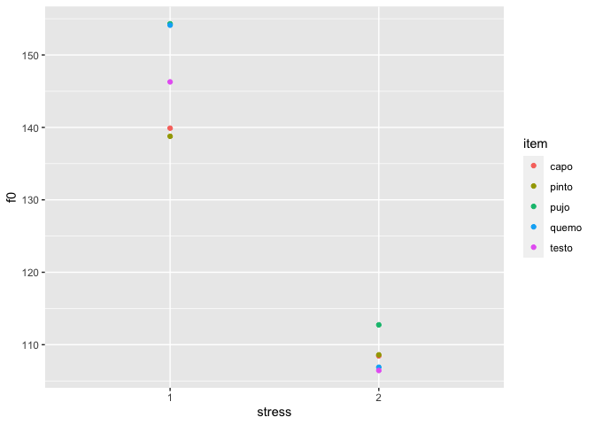
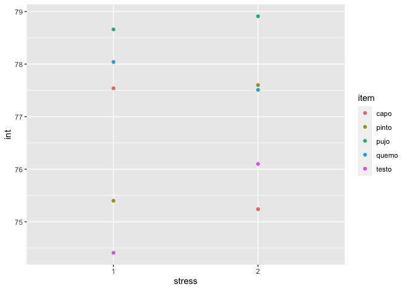

``` r
library(tidyverse)
```

    ## ── Attaching packages ─────────────────────────────────────── tidyverse 1.3.1 ──

    ## ✓ ggplot2 3.3.5     ✓ purrr   0.3.4
    ## ✓ tibble  3.1.6     ✓ dplyr   1.0.8
    ## ✓ tidyr   1.2.0     ✓ stringr 1.4.0
    ## ✓ readr   2.1.2     ✓ forcats 0.5.1

    ## Warning: package 'tidyr' was built under R version 4.0.5

    ## Warning: package 'dplyr' was built under R version 4.0.5

    ## ── Conflicts ────────────────────────────────────────── tidyverse_conflicts() ──
    ## x dplyr::filter() masks stats::filter()
    ## x dplyr::lag()    masks stats::lag()

``` r
library(tidyr)
library(dplyr)
library(here)
```

    ## here() starts at /Users/gabmac/Documents/RU/2022Spring/Phonology/pa_2_2022

``` r
my_data <- read_csv('./data/data.csv')
```

    ## Rows: 10 Columns: 4

    ## ── Column specification ────────────────────────────────────────────────────────
    ## Delimiter: ","
    ## chr (1): info
    ## dbl (3): durationV, f0, int
    ## 
    ## ℹ Use `spec()` to retrieve the full column specification for this data.
    ## ℹ Specify the column types or set `show_col_types = FALSE` to quiet this message.

``` r
my_data %>% 
  summarize(dur_avg = mean(durationV), f0_avg = mean(f0), int_avg = mean(int))
```

    ## # A tibble: 1 × 3
    ##   dur_avg f0_avg int_avg
    ##     <dbl>  <dbl>   <dbl>
    ## 1   0.096   128.    76.9

``` r
my_data %>% 
  separate(., col = info, into = c("item", "stress"), sep = "_") %>%
  ggplot(., aes(x = stress, y = f0, color = item)) +
    geom_point() 
```

<!-- -->

``` r
my_data %>% 
  separate(., col = info, into = c("item", "stress"), sep = "_") %>%
  ggplot(., aes(x = stress, y = int, color = item)) +
    geom_point() 
```

<!-- -->
